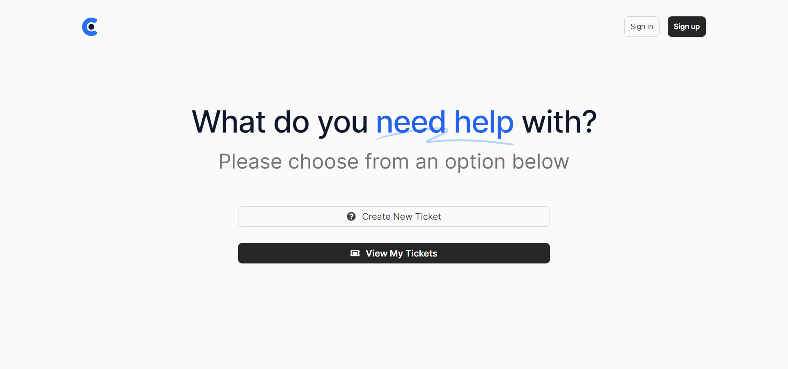

## 📌 Overview

Acara is a fullstack support ticket system. It is a PWA, 100% responsive, and looks stunning on all types of screens and devices.

The tech stack is based on React.js, Redux Toolkit, Tailwindcss, Framer Motion, and Headless UI for the frontend, connected to Nodejs, Express, and MongoDB for the backend.

