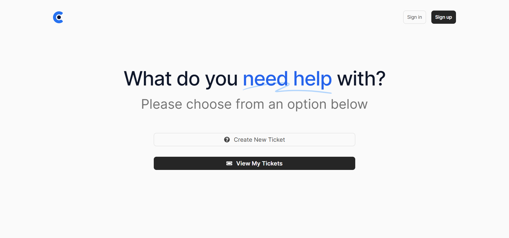

# Acara

Acara is a support ticket system using React.js, Redux Toolkit, Tailwindcss, Framer Motion, and Headless UI. It is a PWA, 100% responsive and looks stunning on all types of screens and devices.

## 🚀 Getting Strated

To get started with Acara, follow these steps:

1. Clone this repository to your local machine.
2. Run `npm install` to install the required dependencies.
3. Run `npm start` to start the web server. 
